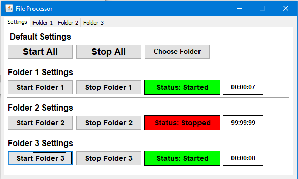

# FileProcessor
 Application that process file from 3 differents folders.

## Introdução
O projeto <i><b>FileProcessor</b></i> foi desenvolvido com o intuito de colocar em prática o conceito de Threads. Neste projeto, o programa processa arquivos de 3 pastas diferentes, onde as pastas são definidas pelo usuário.

### Como funciona?
O programa lê 3 pastas distintas que são definidas pelo usuário, onde após escolher as pastas, o programa roda a leitura de cada pasta a cada 10 segundos para ler os arquivos e mostrar o nome do arquivo e conteúdo na tela do arquivo que foi gravado.

### Imagens do programa
<table>
  <tr>
    <td>Tela principal do programa que mostra o tempo de execução de cada Thread. Também é nessa tela que é acessada a tela de escolher as pastas monitoradas.</td>
    <td>Tela que se escolhe as pastas monitoradas. Após salvar, as informações são gravadas em um arquivo para ficar salvo as preferências do usuário.</td>
  </tr>
  <tr>
    <td></td>
    <td></td>
  </tr>

  <tr>
    <td>Após processar um arquivo em sua respectiva Thread, será listado o nome do arquivo e seu respectivo conteúdo.</td>
    <td>Por padrão, a tela virá apenas com um título e irá sendo alimentada conforme for processando arquivos.</td>
  </tr>
  <tr>
    <td></td>
    <td></td>
  </tr>

</table>

## Algumas limitações

* Não é tratado o encoding do arquivo, então acentuações podem ser apresentadas de forma indevida no log;
* Está sendo considerado que o arquivo lido é apenas texto e em formato de lista, outros formatos podem apresentar problemas.

## Considerações finais

Peço que se possível, caso tiver interesse no programa e realizar o download, deixe uma avaliação e caso encontrar qualquer tipo de problema, me informe para poder corrigí-lo.

Agradeço a todos pela atenção!

Atenciosamente,
Sidnei G. de Azevedo Júnior.